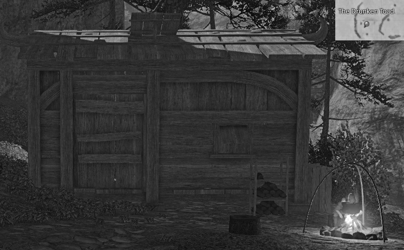

# Dalamud.DrunkenToad
A set of utilities to use in developing dalamud plugins. Equal in prestige to its in-game namesake.



## How to Install
```
Install-Package Dalamud.DrunkenToad
```

## Sample Code
```
using System.Reflection;

using Dalamud.Plugin;
using Dalamud.DrunkenToad;
namespace SamplePlugin
{
    public class DalamudPlugin : IDalamudPlugin
    {
        public string Name { get; }

        public DalamudPlugin(string pluginName, DalamudPluginInterface pluginInterface, Assembly assembly)
        {
            var pluginService = new PluginService(pluginName, pluginInterface);
            this.pluginService.Chat.PrintNotice("Thanks for installing!");
        }

        public void Initialize(DalamudPluginInterface pluginInterface)
        {
            throw new System.NotImplementedException();
        
        }
    }
}
```